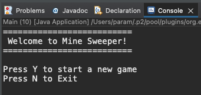
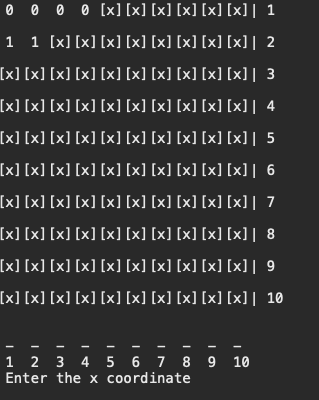

# Java Minesweeper CLI Game

- The Purpose of this project was to build a CLI version of the classic Minesweeper game

## Screenshots

_Game menu_

_Game Screen_

## Setup

- Open in a Java IDE
- Run the Main.java class.

## Description of project (spec / MVP)

- The game was built using Java, with classes to build on OOP principles. The grid is generated using a 2D Array of integers where mines are randomly placed for each game.

- User input is taken in using scanners.

## Approach

- The approach to this project was to create a simple and easy-to-play version of the classic game Minesweeper. The project was implemented in Java, with a simple user interface and clear instructions. The game randomly generates 10 mines in a 10x10 grid, and the user can enter a command that represents a coordinate to check for a mine. The application displays a number from 0-8, depending on how many mines surround that location. If the user selects a mine, the game responds "boom!" and the game is lost. If every non-mine square has been revealed, the game is won. The grid is rendered to the console after every user command.

(The rest can be in any order)

## Reflection

- The game was implemented successfully using a selection of custom methods in their respective classes.

- Classes were split from game logic, Grid operations and the game menu.

- One of the biggest challenges I faced was trying to correctly implement the logic for working out how many mines surround each cell. The Main issue i faced was a bounds error when some mines were closer to borders.

- This however was fixed by adding some logical and checks.

## Future Goals

- If time and skill weren't an object: I would have added more functionality such as difficulty levels and different grid sizes.

- Added a graphical user interface.
- The ability to save and load games.
- cascade empty cells not surrounded by mines.
- Scoreboard

## Further reading or links to inspiration

- [2D Arrays in Java ](https://www.geeksforgeeks.org/multidimensional-arrays-in-java/)
- [Java Arrays Bounds Errors](https://www.educative.io/answers/what-is-the-arrayindexoutofbounds-exception-in-java)

### Stay in touch

- [LinkedIn](https://www.linkedin.com/in/paramsinghau/)

### Licence

